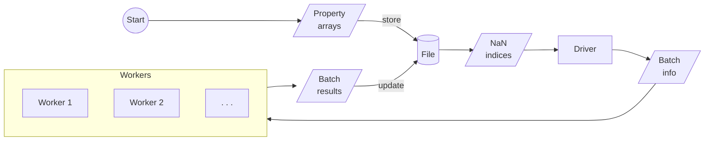

# Calculators

Reptar provides several drivers and workers for calculations on data stored in supported file formats.
The `Driver` class manages all calculations and workers for reptar.

-   [Psi4](https://psicode.org/psi4manual/master/index.html): quantum chemical methods such as DFT and wave function methods.
    -   [`psi4_worker`][calculators.psi4_workers.psi4_worker]
-   [xtb](https://xtb-docs.readthedocs.io/en/latest/contents.html) and [xtb-python](https://xtb-python.readthedocs.io/en/latest/): a semiempirical quantum mechanics method.
    -   `xtb_worker`, `xtb_python_worker`

We use [ray](https://docs.ray.io/en/latest/ray-overview/installation.html) to parallelize our calculations across one or multiple nodes.

## Drivers and workers

Reptar uses a driver (supervisor) and worker workflow where the results are stored in a reptar `File`.
When running calculations, an array is initialized for a desired property (e.g., energy) where all values are `NaN`.
`NaN` values represent a calculation that still needs to run.
The driver then spawns workers with batches of calculations to run.
Results are stored as soon as a worker finishes.



## Data

In order to track and manage calculations, we store relevant data using `Data`.
It contains all supported properties such as atomic positions, energies, gradients, and grid data.

Most calculations involve taking `Data.Z` and `Data.R` from a `source` group and then storing calculations in a destination (`dest`) group.
`Data.prepare_tasks` can assist you with copying over data to the destination and initializing arrays for computed data.

## Tasks

Each worker has a number of `tasks` they can compute based on the external code and reptar support.

### `E`

Computes the total energy of a structure with respect to the provided worker and options.

**Required data:** `Data.E`

### `G`

TODO

**Required data:** `Data.E` and `Data.G`

### `opt`

TODO

**Required data:** `Data.E`, `Data.conv_opt`, and `Data.R_opt`

### `cube`

TODO

**Required data:** `Data.cube_R` and `Data.cube_V`

## Examples

### H2O energy+gradient (Psi4)

This provides a script of computing energy and gradient (`engrad`) calculations with Psi4 of water molecules.
We use [this zarr file](./files/data/1h2o.zarr.zip) (make sure to extract the file first).

=== "Script"

    ```python
    --8<-- "files/scripts/1h2o_psi4_engrads.py"
    ```

=== "Output"

    ```text
    --8<-- "./files/scripts/1h2o-psi4-engrads.txt"
    ```
